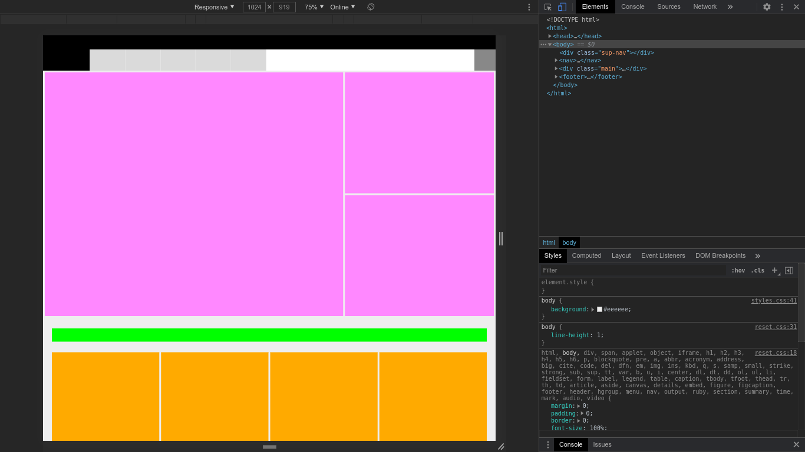
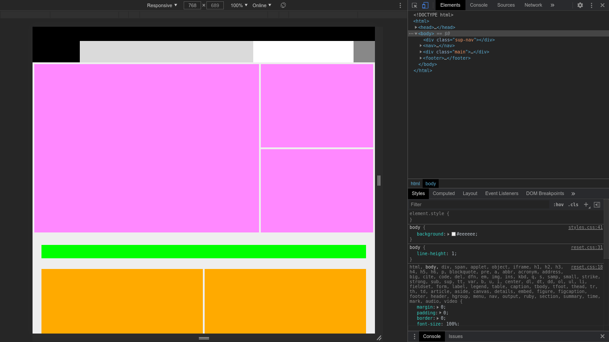
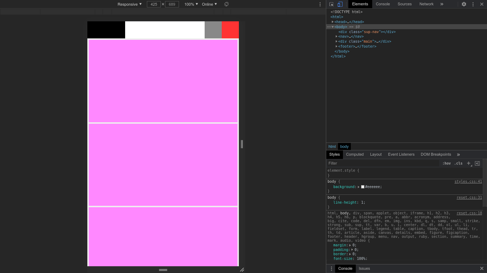
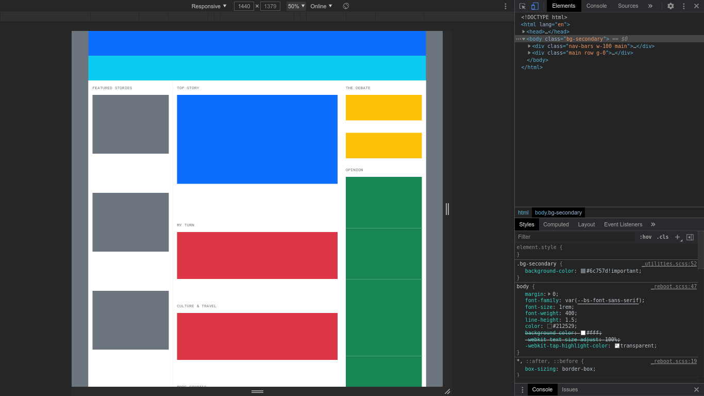
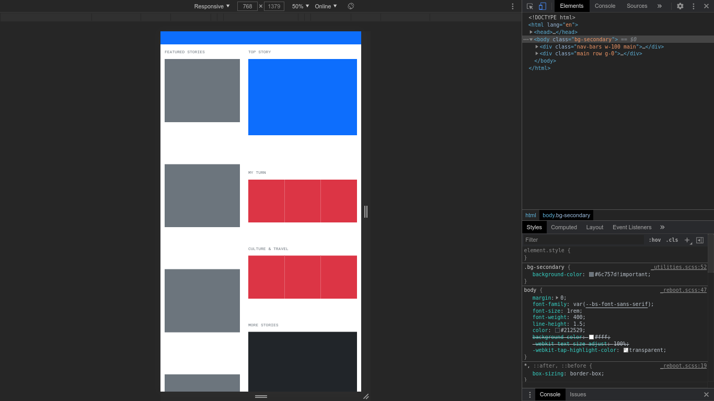
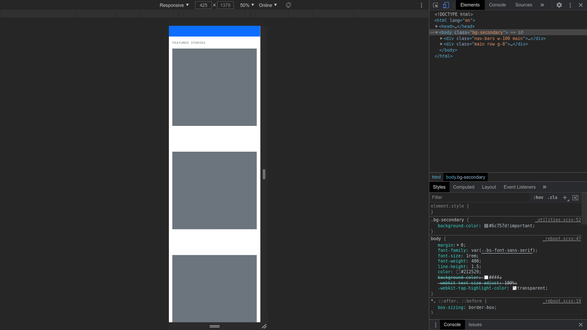

# responsive-layouts

Study of responsive design behavior based on popular web pages. Credits to the
original developers.

***These are not full copies***

|Layout|Original|Technique|
|------|--------|---------|
|tnw|[The Next Web](https://thenextweb.com/)|flexbox and grid|
|nw|[Newsweek](https://www.newsweek.com/)|bootstrap|
|mcq|[McQuade Inc.](https://mikemcquade.com/)|[simple-gird](https://github.com/dreadsd/simple-grid)|

## Installation
```sh
git clone https://github.com/dreadsd/responsive-layouts.git
cd responsive-layouts
```
Open the index.html file from the desired layout with
[one of the following browsers](https://github.com/dreadsd/responsive-layouts#support).

## Usage
Resize the window with dev tools.

## Support
This is a general grid and flexbox browser support, check yours.
See
[Bootstrap](https://getbootstrap.com/docs/5.0/getting-started/browsers-devices/#supported-browsers)
for its support.

|Browser|Version|
|-------|-------|
|Chrome | > 57  |
|Firefox| > 52  |
|Edge   | > 16  |
|Safari | > 10.1|
|Opera  | > 12.1|

## License
[MIT](https://opensource.org/licenses/MIT)

## Screenshots
### TNW



### NW



